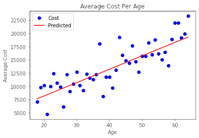
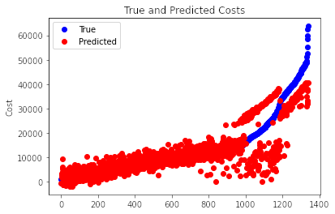

### Hi there,

I am a programmer interested in machine learning, data science, and software engineering.

## Current Projects:
- [MNIST From Scratch](https://github.com/nelsen129/mnist-from-scratch): A neural network created and trained without using a machine learning framework, such as TensorFlow or Pytorch, requiring a manual implementation of data processing, network creation, and backpropagation.

## Completed Projects:
- [US Medical Insurance Costs](https://github.com/nelsen129/us-medical-insurance-costs): A series of regressions on several variables, such as age and BMI, and the resulting insurance costs. I performed several simple regressions and implemented gradient descent for multiple regressions.  

## Currently Learning:
- Codecademy's Data Science Career Path

You can reach me at patrick@nelsen13.com 
